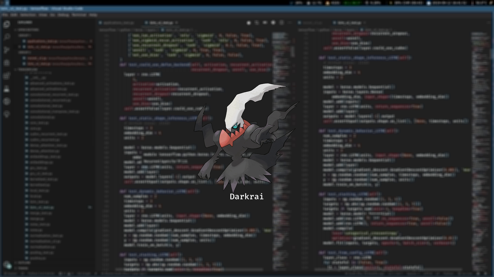

# Pokemon Lock Screen

## Dependencies
1. [jq](https://stedolan.github.io/jq/) => `sudo apt-get install jq`

## Download pokemon images
1. Download [scrap-data.sh](https://github.com/adityaa30/my-scripts/blob/master/pokemon-i3lock/scrap-data.sh) and [final-lock.sh](https://github.com/adityaa30/my-scripts/blob/master/i3/final-lock.sh)
2. `chmod +x scrap-data.sh`
3.  A folder `scrapped-data` will be created with 807 pokemon images
4. Update `$scrap_dir` variable value in `final-lock.sh` to Absolute Path of `scrapped-data` folder created in Step 4.
5. Bind `final-lock.sh` script to a keyboard shortcut to lock screen in i3 config file. Eg: [config](https://github.com/adityaa30/my-scripts/blob/master/i3/config#L195):

## Add names to each photograph
1. Run `python3 add-images.py --path <Path to save named photos`
2. Update `$scrap_dir` variable value in `final-lock.sh` to Absolute Path of `scrapped-data` folder created in Step 1.

## Example

